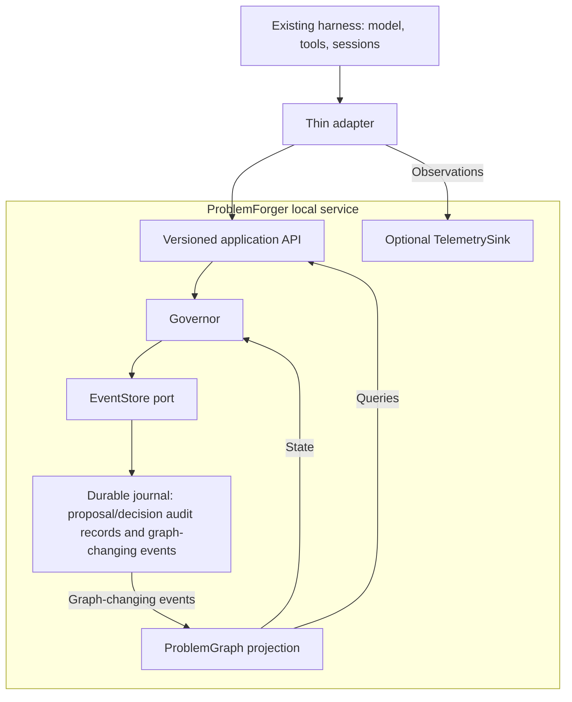

# Architecture

## Boundaries

The worker/harness may propose changes. It does not own authoritative graph state. Local enforcement follows [STORE-OWNER](protocol.md#spec-protocol-store-owner) and [EVIDENCE-TRUST](verification.md#spec-verification-evidence-trust); a separate process alone is not a security boundary.

ProblemForger runs as a separate local process/service for the PoC. HarnessX and Pi use thin clients/adapters against the same service contract. This preserves a symmetric integration boundary even though HarnessX and the core are both Python.

## Durable journal and observation plane

ProblemForger separates durable governance/audit history from optional harness telemetry.

### Durable run journal

Every run has one append-only journal persisted through `EventStore`.

The journal contains two classes of durable records:

- **governance audit records** — proposal receipt plus final governance outcomes such as `COMMIT`, `REJECT`, `RETRY`, `ESCALATE`, or `CONFLICT`; these are required for auditability and evaluation but do not change graph state;
- **graph-changing domain events** — committed node/edge/evidence/lifecycle changes that reconstruct the ProblemGraph.

Every journal record has a monotonic `journal_position`. Each successfully committed graph mutation batch advances `graph_version` exactly once; all graph-changing events in that batch carry the same resulting graph version.

A completed governance response requires a durable decision. Proposal receipts retain recoverable input; the single owning service serializes evaluation and finalization. Detailed recovery rules belong to [PROPOSAL-RECOVERY](protocol.md#spec-protocol-proposal-recovery), and store ownership to [STORE-OWNER](protocol.md#spec-protocol-store-owner). Parallel claims and leases are deferred until a measured PoC need justifies them.

### Observation/telemetry events

Harness lifecycle events, model calls, tool calls, token/cost measurements, and adapter diagnostics are useful for evaluation and UI, but are not the governance audit log and are not required for graph replay.

They flow through `TelemetrySink` and may reference durable journal records through correlation/causation identifiers.

Telemetry may be disabled without losing authoritative graph state or governance outcomes.

See [ADR 0006](adr/0006-authoritative-domain-events-and-stream-concurrency.md).

## Layers

### Domain/core

Contains:

- graph domain types;
- graph mutation semantics;
- entity lifecycle and provenance;
- governance policy interfaces;
- durable governance audit-record and graph-domain-event definitions;
- pure replay/projection logic.

It must not depend on persistence providers (including SQLite, PostgreSQL,
`dbm`, or `shelve`), a specific model API, HarnessX, Pi, a UI framework
(including `tkinter`), or provider-specific settings.

The core also does **not** own model inference in the initial PoC. Model execution remains a harness responsibility. Later routing asks the harness to select a model; it does not move inference into the core.

### Application API

The application layer exposes harness-neutral, run-scoped graph/proposal
commands and bounded graph/audit queries. Operations carry an explicit
`run_id`, and proposal status is keyed by `(run_id, proposal_id)`; the durable
ordering and recovery semantics are defined by the [protocol
contract](protocol.md#spec-protocol-proposal-recovery).

The initial agent interaction uses this explicit API/tool surface rather than automatic full-graph prompt injection. This avoids introducing a context-selection subsystem before the graph/governance hypotheses have been tested.

See [ADR 0008](adr/0008-explicit-agent-graph-api-for-initial-poc.md).

### Ports

The initial ports, provider responsibilities, and deferred-port policy are
owned by [Modules](modules.md#spec-modules-eventstore-port). This architecture
keeps only the boundary rule: introduce a port for a real replaceable policy or
infrastructure boundary, not as a generic service locator.

Do not add `ModelProvider` or `ContextSelector` to the initial core. The harness already owns model execution, and the initial PoC uses explicit graph queries instead of automatic context selection.

### Modules/adapters

Concrete providers and their configuration are specified in [Modules](modules.md).
Harness integrations are adapters to the service protocol, not provider modules
inside the core.

Harness-specific **raw trajectory archives** used for experiment reproducibility are also adapter/evaluation concerns, not core concerns. HarnessX and Pi may have different native trajectory schemas. Those raw artifacts remain external/content-addressed and are never written into the authoritative ProblemForger journal. Core domain types, `EventStore`, and graph replay must not depend on harness-native trajectory formats. Adapters may separately emit harness-neutral normalized observations through `TelemetrySink`.

Provider-specific configuration belongs to the provider module.

### Composition root and configuration

A typed loader maps a capability and provider name to validated configuration
and an explicit factory/registry entry, as defined in [Modules](modules.md).

Core code receives implementations of ports, never raw provider configuration.

Provider lookup is explicit. The PoC does not dynamically import arbitrary classes from configuration strings.

## Event sourcing and audit persistence

Graph state is projected from complete committed mutation batches in the journal; a partial batch is never an addressable graph state. A commit decision and its graph events persist atomically, with optimistic graph-version checks preventing stale writes. Audit-only records do not advance `graph_version`. Persistence failure is not a completed governance outcome.

The [EventStore port](modules.md#spec-modules-eventstore-port) owns operation signatures and statuses. [PROPOSAL-RECOVERY](protocol.md#spec-protocol-proposal-recovery) owns append atomicity, terminal outcomes, serialized recovery, and replay behavior.

There is no required global order across independent runs.

Snapshots may be added later as a derived optimization but may not become the source of truth.

See [ADR 0006](adr/0006-authoritative-domain-events-and-stream-concurrency.md).

## Graph governor

The governor evaluates proposed mutations using:

1. schema and deterministic graph invariants;
2. relevant deterministic or externally observed evidence;
3. later, learned/LLM verification when necessary;
4. policy and uncertainty.

Possible outcomes are:

- commit;
- reject;
- retry;
- escalate;
- conflict when the proposal is based on a stale graph version.

The initial P6 experiment compares baseline **A** with the complete graph/governance package **C**. Configuration **B** (graph without governance) is an optional, separately frozen diagnostic, not a prerequisite. [ADR 0005](adr/0005-ablation-first-evaluation.md) owns this decision; [Evaluation](evaluation.md) owns experiment definitions and analysis.

## Harness adapters

Adapters:

- register or expose ProblemForger graph tools/commands to the worker;
- normalize relevant harness observations into telemetry;
- translate governor outcomes into harness actions;
- declare capabilities.

Candidate capabilities include:

- can block tool call;
- can inject context;
- can replace model;
- can pause/resume;
- can render native status UI.

Adapters must not contain graph/governance policy.

Adapter capabilities are checked against pinned harness revisions during P4/P5 preparation; [Related work](related-work.md) provides background rather than a capability contract.

## Runtime language

- ProblemForger core/service: Python 3.12+.
- HarnessX adapter: Python client/processor.
- Pi adapter: TypeScript extension/client.

The transport is intentionally left for a bounded P1 decision. Changing transport must not change the domain/application protocol.

See [ADR 0009](adr/0009-separate-local-process-service-boundary.md).

## UI

UI/observer clients are outside the correctness path and consume three read-only views:

- optional normalized observation/telemetry events for model/tool/runtime activity;
- graph projections for authoritative graph state;
- a durable governance/audit timeline projection exposed through the application API from run-journal audit records.

The audit timeline remains available even when telemetry is disabled and includes proposal receipts plus non-commit outcomes such as `REJECT`, `RETRY`, `ESCALATE`, and `CONFLICT`. Observers must use the service/application read API rather than access `EventStore` directly.

Native harness UI may expose compact status. A later web observer may combine graph state, durable governance provenance, and optional telemetry for full timeline inspection.
